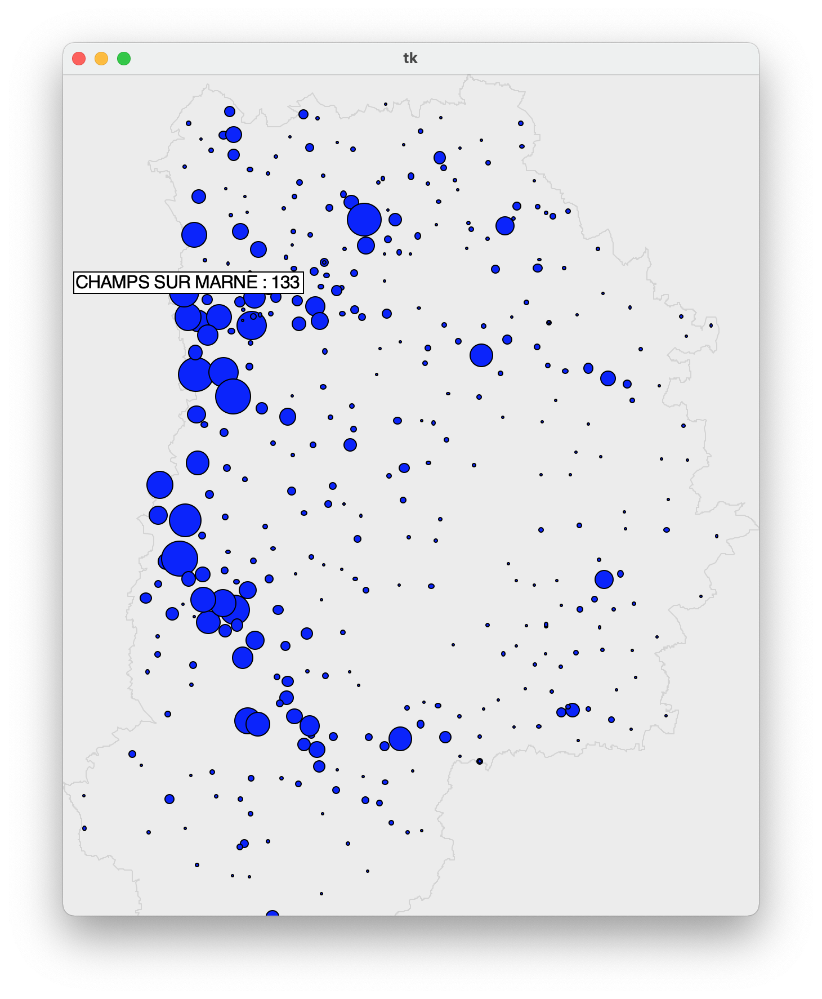

# Visualisation of geolocated data
The objective of this problem is to visualize various collections of data
geolocated on a map, using `fltk`. We will rely for this on publicly available data
available, for example on the government site dedicated to “open data”, [data.gouv.fr](http://data.gouv.fr).
## Example

Here is a screenshot showing a prototype of this program :

This is a map of Seine-et-Marne, where each disc represents the number of members of a sports federation (here the French basketball federation in 2011).

The area of each disk is proportional to the number of licensees. The name of a municipality and the number of members living there are displayed when the mouse pointer hovers over the corresponding disc.

You can select the region in the main menu and go back to the main menu by doing left click.

